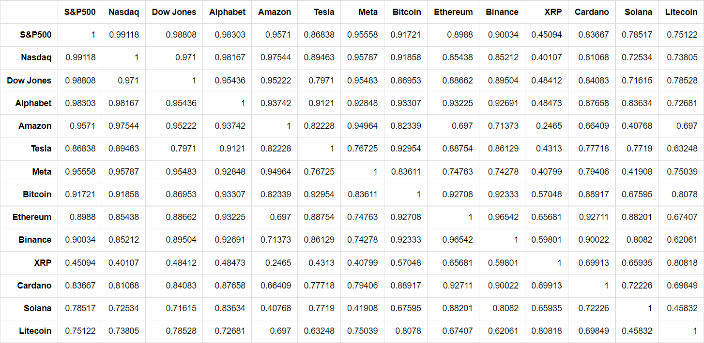

# Some-Correlations

### Correlations
```correlations.ipynb``` represents correlations between tickers in ```tickers.xml``` file,
which contains popular Market Indexes ([S&P500](https://en.wikipedia.org/wiki/S%26P_500),
[Nasdaq](https://en.wikipedia.org/wiki/Nasdaq) and
[Dow Jones](https://en.wikipedia.org/wiki/Dow_Jones_Industrial_Average)),
companies' stocks (tops based on their market capitalizations) and
popular cryptocurrencies.
</br>
</br>

